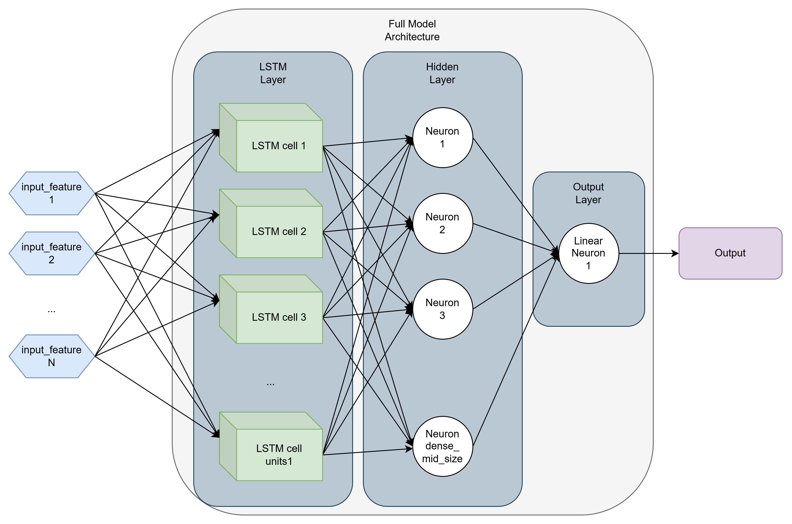

# TECH CHALLENGE 4 - PREVISÃO DE SÉRIES TEMPORAIS COM LSTM

## Overview da Solução

Falar sobre o modelo e os objetivos que são atingidos.

### Requisitos
* Docker instalado.

### QuickStart

Para subir a arquitetura, navegue pelo terminal até o diretório contendo `docker-compose.yml` e execute o seguinte comando:
```
docker compose up -d --build
```

Os logs do container indicarão sucesso ao carregar o modelo com as mensagens `Model / Scaler loaded successfully`. A API está disponível na porta `5000`. Você pode acessar a documentação-Swagger da API pelo endereço: `http://localhost:5000/docs`. Para realizar uma predição, faça uma requisição POST para `http://localhost:5000/predict` contendo um `body` (*input*) análogo ao seguinte exemplo:
```
body = {
  "end_date": "2024-11-15",
  "start_date": "2024-06-01",
  "seq_length": 20,
  "horizon": 1
}
```

### Diretórios e Arquivos

TREE

### Por dentro da API

Após a requisição, dentro dessa API, será montado um Data Frame contendo os valores do(s) ativo(s) entre as datas `start_date` e `end_date`. Desta forma, internamente, tem-se um Data Frame no seguinte formato (considerando o exemplo acima com o ativo "PETR4.SA"):
```
Index | Datetime | Value
0   | '2024-06-03T00:00:00+00:00' | 36.4732551574707      -> X[0]
1   | '2024-06-04T00:00:00+00:00' | 36.06673812866211     -> X[1]
2   | '2024-06-05T00:00:00+00:00' | 36.11400604248047     -> X[2]
...
117 | '2024-11-13T00:00:00+00:00' | 36.880001068115234    -> X[117]
118 | '2024-11-14T00:00:00+00:00' | 37.27000045776367     -> X[118]
```
Além disso, é montado um conjunto de dados no formato de TimeSeries com janela móvel de tamanho `seq_length`. Desta forma, dado um horizonte de predição igual a 1 (dia) são utilizados vetores de entrada `X[a:a+seq_length]` para predizer o valor do dia seguinte `X[a+seq_length+1] = y_pred[a+seq_length+1]`, i.e.:
```
X[0:seq_length-1]   -->  y[seq_length]    
X[1:seq_length]     -->  y[seq_length+1] 
...
X[N-seq_length:N]   -->  y[N+1],           
```
que no nosso exemplo:
```
X[0:19]     -->    y_pred[20]  = 37.381282806396484 = X_pred[20]
X[1:20]     -->    y_pred[21]  = 37.739967346191406 = X_pred[21]
...
X[98:117]   -->    y_pred[118] = 37.2889518737793   = X_pred[118].
```

### Testando a API com Código Python

Há um Jupyter Notebook contendo o exemplo de uso acima da API para que o usuário possa interagir e entender melhor o seu funcionamento. Tal notebook pode ser acessado em [training_model/api_predict.ipynb](/training_model/api_predict.ipynb).

## Etapas da Solução

### Coleta de Dados e Pre-processamento

`feature_engineering.py`
* `get_finance_df`: obtém os dados do ativo desejado utilizando a biblioteca `yfinance`, que são retornados em um DataFrame. Nesse método, também é aplicado o `pandas.interpolate()`. Temos alguns dados NAs no Dataframe. Removê-los faria perder informação. Preencher com valor default também não atende todos os cenários, já que a média dos valores oscila muito, e os valores são muito distantes de `0` também. Neste cenário, interpolate se mostrou a melhor estratégia, inclusive nos testes de treinamento do modelo.

* `split_train_test_valid_df`: retorno de forma facilitada do dataframe quebrado em partes para treino e teste (e validação, se desejável).

* `shift_drop_na_in_xy`: criação de uma nova coluna no DataFrame com shift temporal parametrizável, que representa o horizonte de predição `horizon_pred`. Por conta do shift temporal, pode haver a introdução de NAs nos dados nos "extremos" (primeiras/últimas linhas). Logo, uma operação de `dropna()` é realizada.

* `get_xx_dropna`: faz o retorno apenas dos valores do DataFrame (`df["X"].values`). Isso é útil quando usamos a classe `TimeseriesGenerator` do Keras/TF em conjunto com um shift temporal de apenas 1 amostra, já que essa função faz esse shift automaticamente. Neste caso, o uso da função `shift_drop_na_in_xy` é dispensado, porém, não há como fazer um shift temporal em mais de 1 unidade de tempo.

* `TimeseriesGenerator`: gera um conjunto de dados de treinamento aplicável ao cenário de séries temporais em modelos Auto-Regressivos (AR). Mais detalhes em [https://www.tensorflow.org/api_docs/python/tf/keras/preprocessing/sequence/TimeseriesGenerator](https://www.tensorflow.org/api_docs/python/tf/keras/preprocessing/sequence/TimeseriesGenerator).

DIAGRAMA DE BLOCOS DO PRE-PROCESSAMENTO

### Desenvolvimento do Modelo LSTM e Arquitetura Final

O Desenvolvimento do modelo segue os passos descritos em em [training_model/READ.ME](/training_model/README.md) e em [training_model/Experiment_Design.drawio](/training_model/Experiment_Design.drawio). 

A Arquitetura Final do Modelo Campeão é dada na Figura a seguir.



### Artefatos do Modelo - Save/Load Model

Os artefatos do modelo e do scaler (transformação) são salvos na pasta [src/artifacts](/src/artifacts) a partir do script [training_model/training_model.ipynb](/training_model/training_model.ipynb), usando o `mlflow` com os comandos `log_model()` e `save_model()`. 

Também são salvos os Datasets utilizados (em diferentes formatos, como pandas Data Frame e Numpy Arrays), os parâmetros de treinamento e as métricas obtidas.

### Deploy do Modelo - API FastAPI e Docker

Para deploy do modelo, foram utilizados 3 containers docker definidos em [docker-compose.yml](/docker-compose.yml), sendo 2 deles usados no monitoramento (descrito a seguir) e um deles, chamado de `app`, para a API.

A API, estruturada em [src/main.py](/src/main.py), faz uso de funções auxiliares definidas em [src/feature_engineering.py](/src/feature_engineering.py) para tratamento dos dados, conforme explicado acima, e em [src/model_functions.py](/src/model_functions.py).

### Escalabilidade e Monitoramento

O monitoramento e a escalabidade são tratados pelas ferramentas **Prometheus** e **Grafana**, que são executados nos seus respectivos containers de mesmo nome.
O Prometheus é o responsável por monitorar e realizar o log das métricas sinalizadas na API. Suas configurações são encontradas em [prometheus.yml](/prometheus.yml).
Já o Grafana é onde são criados e mantidos os Dashboards, onde as métricas logadas podem ser observadas a partir de interfaces gráficas pré-definidas. O arquivo de configuração do dashboard do Grafana é o [dashboard.json](/dashboard.json)

### Trabalhos Futuros / Possíveis Melhorias

Entendemos que algumas melhorias poderiam ser implementadas nesta solução, sendo algumas delas:

* Revisão das boas práticas de código para melhor implementação e organização das funções, métodos, classes, e chamadas na API, ou seja, aplicação dos princípios de *Clean Code*.
* Adoção de testes automatizados para melhor qualidade e manutenção do código, como já feito em Tech Challenges anteriores: [tech-c-01-embrapa-api](https://github.com/chrysremes/tech-c-01-embrapa-api)
* Adição de um novo caminho na API que realize, dada apenas 1 data válida, faça a predição de 1 passo a frente apenas para essa data (e não para um conjunto de dados, como está implementado).
* Adição de um método que realiza a predição de `h` passos a frente (e não apenas 1), chamando o `model.predict` de forma "iterativa".
* Criação de um novo modelo (ou de novos modelos / ensamble de modelos), visando melhorar a qualidade da predição `h` passos a frente, com `h` variando de `2` a `H`.


