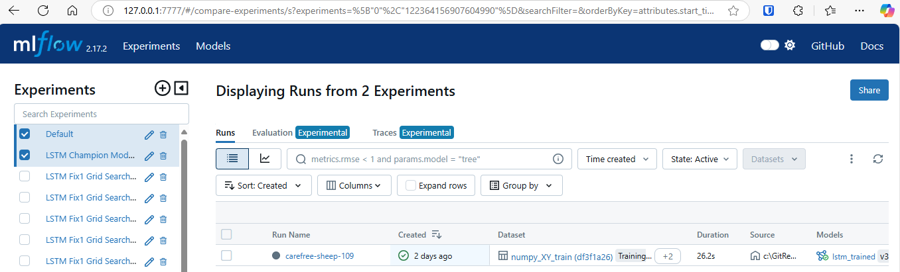

# Desenvolvimento do Modelo

## Fase 1 - Entendimento básico e baseline model
* Qual a ordem de grandeza de células LSTM necessárias para um modelo inicial? 10, 50, 100, 500?
**R: Cerca de 100 units, ao menos**
* Quantas camadas LSTM são necessárias? Apenas 1 é suficiente? 2 camadas mais ajuda ou atrapalha?
**R: 1 camada era o ótimo, mais que isso piorava**
* Qual função de ativação e sai melhor inicialmente? sigmoid, relu, tanh?
**R: relu se mostrou muito superior logo de cara**
* Qual a ordem de grandeza do número de batches de dados? 10, 20, 50?
**em torno de 10 a 30 deu resultados inicialmente satisfatórios**
* Qual a ordem de grandeza de dias passados necessários para prever o próximo dia? janela de 5, 10, 15, 30 dias passados?
**em torno de 10 a 30 deu resultados satisfatórios**
* Qual o optimizer que podem ser usado como baseline inicial? adam, SGD?
**adam se mostrou muito melhor que SGD, descartamos SGD aqui**
* Log dos Experimentos? 
**Uso do `mlflow`.**

## Fase 2 - Definição dos inputs da ação
Sobre o uso de Open, High/Low, Close, Volume, Adj. Close
* **Open, High, Low, Close e Adj Close são muito correlacionados, escolher apenas o que será a variável target**
* **Volume não se mostrou adequado para predição**
* **Entre Close e Adj. Close, escolhemos o Adj. por ser um preço de fechamento já ajustado e mais indicado na literatura.**

# Fase 3 - Sobre o uso de variáveis exógenas
Escolhemos, além da ação (PETR4.SA) a taxa de câmbio Real / Dólar (6L=F) e o preço do Barril Brent internacional (BZ=F) para testes:
* **O uso dessas variáveis trouxe melhorias marginais nas estimativas e na redução de overfitting**
* **Entendemos que o custo computacional e a complexidade da arquitetura não compensavam os ganhos de performance e ficamos com apenas 1 variável (PETR4.SA).**


# Fase 4 - Experimentos de refinamento do modelo
Parâmetros avaliados
* `seq_length`: quantidade de passos passados (tamanho da janela)
* `batch_size`: tamanho de cada batch de treinamento
* `units1`: quantidade de células LSTM na camada 1
* `activation1`: tipo de função de ativação na camada 1 LSTM (relu / sigmoid)
* `kernel_reg_factor1`: fator de ponderação da regularização (L2) do kernel da LSTM visando redução de overfitting
* `dropout_layer1`: fator de dropout da camada 1 LSTM para evitar overfitting
* `activation_output`: tipo de função de ativação da camada e saída (última)
* `optim`: algoritmo de otimização
* `company_inputs`: variáveis de entrada do modelo - apenas "PETR4.SA" ou ["PETR4.SA", "BZ=F", "6L=F"]. Escolhemos apenas 1 input pois a complexidade adicional não compensava os ganhos com 3 inputs
* `dense_mid_size`: quantidade de neurônios/unidades "comuns" (usados em ANN e DNN) da camada 2. Usamos 0 ou None para testar sem essa segunda camada. **Importante**: aqui, estamos falando de uma camada 2 com neurônios comuns, e NÃO de células LSTM. Uma camada 2 com células LSTM foi descartada na Fase 1 dos Experimentos.

# O Modelo Campeão

O modelo campeão, considerando tanto métricas de performance (R2-Score, RMSE, validation_loss) quanto complexidade e custo computacional (apenas 1 variável em `company_inputs` e menor número de `units1`, `dense_mid_size` e `seq_length`), foi:
```
name: carefree-sheep-109 
Experiment ID: 122364156907604990
Run ID: fde308e2d6f54dbbbd6cf407fb5e1b65
```
Metrics:
```
final_loss = 0.0005052845808677375
final_val_loss = 0.0005925219156779349
R2-Score = 0.8241635082948711
RMSE = 0.7402838579704708
```

Parameters:
```
seq_length = 20
batch_size = 10
units1 = 130
activation1 = 'relu'
kernel_reg_factor1 = 0.001
dropout_layer1 = 0.05
dense_mid_size = 80
activation_out = 'relu'
optim = 'nadam'
company_inputs = ['PETR4.SA']
```

